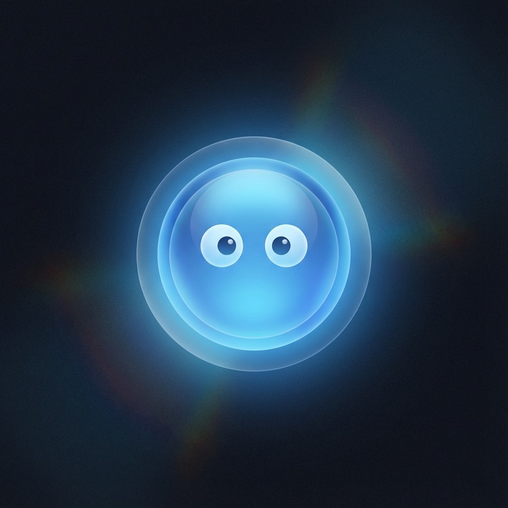

# Glitch Desktop Companion Landing Page

A modern, high-performance landing page for the Glitch Desktop Companion, your AI assistant powered by Gemini and Google Live.



## Features

- **Cyberpunk Aesthetics**: Vibrant colors, glassmorphism, and dynamic animations.
- **Glitch Text Effects**: Custom glitch animations for a high-tech feel.
- **Interactive Background**: Click spark effects and animated grid patterns.
- **Responsive Design**: Fully optimized for all screen sizes.
- **Tech Stack Showcase**: Animated logo loop featuring core technologies.
- **Download Button**: Direct link to the latest Windows installer.

## Tech Stack

- **Framework**: [React](https://react.dev/)
- **Bundler**: [Vite](https://vitejs.dev/)
- **Styling**: [Tailwind CSS](https://tailwindcss.com/)
- **Animations**: [Framer Motion](https://www.framer.com/motion/)
- **Icons**: [Lucide React](https://lucide.dev/)

## Getting Started

### Prerequisites

- Node.js (v18 or higher)
- npm or yarn

### Installation

1. Clone the repository:
   ```bash
   git clone https://github.com/rohith-m06/Glitch-desktop_Companion_webpage.git
   ```

2. Navigate to the project directory:
   ```bash
   cd landing_page_react
   ```

3. Install dependencies:
   ```bash
   npm install
   ```

### Development

Start the development server:
```bash
npm run dev
```

### Build

Build for production:
```bash
npm run build
```

## Deployment

This project is configured for deployment on [Vercel](https://vercel.com/).

```bash
vercel --prod
```

## Download

Get the latest Windows installer:
[Download Glitch Desktop Companion v1.0.5](https://github.com/KirthanNB/AI-Companion/releases/download/v1.0.5/AI-Desktop-Companion-Setup-Glitch-v.1.0.5.exe)

## License

Open Source - see the repository for license details.
